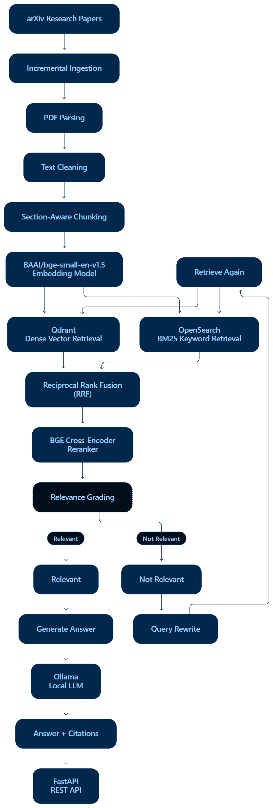

# ArXivRAG — Research Paper Retrieval-Augmented Generation System

A production-oriented **Retrieval-Augmented Generation (RAG)** system for querying research papers from arXiv. The system combines semantic vector retrieval, keyword-based BM25 retrieval, Reciprocal Rank Fusion (RRF), cross-encoder reranking, and local LLM-based generation to provide grounded answers with source citations.

The project is designed as an end-to-end AI engineering system rather than a simple RAG chatbot, covering document ingestion, retrieval, evaluation, orchestration, API serving, and production-oriented infrastructure.

---

## Architecture



---

## Key Features

* arXiv research-paper ingestion pipeline
* PDF parsing using PyMuPDF
* Text cleaning and normalization
* Section-aware document chunking
* Local sentence-transformer embeddings
* Dense vector retrieval using Qdrant
* BM25 keyword retrieval using OpenSearch
* Hybrid retrieval using Reciprocal Rank Fusion
* Local BGE cross-encoder reranking
* Retrieval evaluation using standard IR metrics
* LangGraph-based RAG orchestration
* Query routing and query rewriting
* Document relevance grading
* Iterative retrieval
* Local LLM inference using Ollama
* LangChain integration
* Source-grounded answer generation
* FastAPI REST API
* Redis caching
* Docker-based infrastructure
* Incremental ingestion architecture
* Production-oriented observability design

---

## Dataset

The current corpus contains:

* **279+ arXiv research papers**
* **16,237 processed chunks**
* Research areas including:

  * Retrieval-Augmented Generation
  * Large Language Models
  * Information Retrieval
  * Embeddings
  * NLP
  * AI Agents
  * Machine Learning

The dataset was collected from relevant arXiv categories including:

```text
cs.AI
cs.CL
cs.LG
cs.IR
```

Large raw datasets, generated embeddings, processed files, and model artifacts are intentionally excluded from Git because of their size.

---

## Retrieval Pipeline

### 1. Dense Retrieval

Research-paper chunks are embedded using:

```text
BAAI/bge-small-en-v1.5
```

The embeddings are stored in **Qdrant** and retrieved using cosine similarity.

### 2. BM25 Retrieval

The same chunks are indexed in **OpenSearch** and searched using BM25 keyword matching.

This provides lexical retrieval capabilities that complement semantic vector search.

### 3. Hybrid Retrieval

Dense and BM25 rankings are combined using:

```text
Reciprocal Rank Fusion (RRF)
```

This allows the system to benefit from both semantic similarity and exact keyword matching.

### 4. Reranking

The retrieved candidates are further ranked using:

```text
BAAI/bge-reranker-base
```

The cross-encoder evaluates the relationship between the query and candidate document and produces a more refined ranking.

---

## Retrieval Evaluation

The project includes a custom retrieval evaluation framework using:

* Precision@K
* Recall@K
* Mean Reciprocal Rank (MRR)
* Normalized Discounted Cumulative Gain (nDCG)

The initial evaluation contains **10 queries** with **42 labeled relevant-paper assignments**.

### Current Results

| Method     | Precision@5 | Recall@5 | Precision@10 | Recall@10 |    MRR | nDCG@5 | nDCG@10 |
| ---------- | ----------: | -------: | -----------: | --------: | -----: | -----: | ------: |
| Dense      |      0.6000 |   0.7200 |       0.4244 |    0.7400 | 0.9000 | 0.7359 |  0.7466 |
| BM25       |      0.4600 |   0.5550 |       0.3028 |    0.5950 | 0.8833 | 0.5858 |  0.6081 |
| Hybrid RRF |      0.6000 |   0.7150 |       0.4200 |    1.0000 | 0.9333 | 0.7420 |  0.8906 |

The Hybrid RRF evaluation achieved:

```text
Recall@10 : 1.0000
MRR       : 0.9333
nDCG@10   : 0.8906
```

These results are measured on the project's current 10-query evaluation set and should not be interpreted as a general benchmark of RAG retrieval performance.

---

## Project Structure

```text
ArXivRAG/
│
├── app/
│   ├── ingestion/
│   │   ├── download_papers.py
│   │   ├── parse_pdfs.py
│   │   ├── clean_text.py
│   │   ├── section_chunker.py
│   │   ├── embed_chunks.py
│   │   └── verify_embeddings.py
│   │
│   ├── retrieval/
│   │   ├── setup_qdrant.py
│   │   ├── load_qdrant.py
│   │   ├── setup_opensearch.py
│   │   ├── retrieval_metrics.py
│   │   ├── evaluate_dense.py
│   │   ├── evaluate_bm25.py
│   │   ├── evaluate_hybrid.py
│   │   └── test_reranker.py
│   │
│   └── rag/
│       └── nodes/
│
├── evaluation/
│   └── queries.json
│
├── airflow/
│   └── dags/
│
├── data/
│   ├── raw/
│   ├── processed/
│   └── processed_clean/
│
├── docker-compose.yml
├── main.py
├── pyproject.toml
├── requirements.txt
├── uv.lock
└── README.md
```

---

## Technology Stack

### Programming

* Python
* SQL

### RAG / LLM

* LangChain
* LangGraph
* Ollama
* Sentence Transformers

### Retrieval

* Qdrant
* OpenSearch
* BM25
* Reciprocal Rank Fusion
* BGE Cross-Encoder Reranker

### Data Processing

* PyMuPDF
* NumPy
* Pandas

### API

* FastAPI
* Uvicorn

### Infrastructure

* Docker
* Docker Compose
* Redis

### Development

* uv
* Git
* GitHub

---

## Installation

### 1. Clone the repository

```bash
git clone https://github.com/baihelahusain/ArXivRAG.git
cd ArXivRAG
```

### 2. Create the environment

Using `uv`:

```bash
uv sync
```

Activate the environment if required.

Windows PowerShell:

```powershell
.venv\Scripts\Activate.ps1
```

### 3. Start infrastructure

```bash
docker compose up -d
```

This starts the infrastructure required by the retrieval pipeline.

### 4. Verify services

Qdrant:

```text
http://localhost:6333
```

OpenSearch:

```text
http://localhost:9200
```

---

## Running the Pipeline

### PDF Parsing

```bash
python -m app.ingestion.parse_pdfs
```

### Text Cleaning

```bash
python -m app.ingestion.clean_text
```

### Chunking

```bash
python -m app.ingestion.section_chunker
```

### Embedding Generation

```bash
python -m app.ingestion.embed_chunks
```

### Qdrant Setup

```bash
python -m app.retrieval.setup_qdrant
```

### Load Embeddings into Qdrant

```bash
python -m app.retrieval.load_qdrant
```

### OpenSearch Setup

```bash
python -m app.retrieval.setup_opensearch
```

---

## Running Evaluation

Dense retrieval:

```bash
python -m app.retrieval.evaluate_dense
```

BM25:

```bash
python -m app.retrieval.evaluate_bm25
```

Hybrid RRF:

```bash
python -m app.retrieval.evaluate_hybrid
```

Evaluation results are stored under:

```text
evaluation/results/
```

---

## Local LLM

The final RAG generation pipeline uses **Ollama** to run open-source language models locally.

This avoids dependence on paid external LLM APIs and allows the complete RAG workflow to run locally.

Example:

```bash
ollama pull llama3.1
```

The selected model can then be used through LangChain for answer generation.

---

## API

The RAG pipeline is exposed through FastAPI.

Example endpoint structure:

```text
POST /api/v1/query
```

Example request:

```json
{
  "query": "How does RAG reduce hallucination?"
}
```

Example response:

```json
{
  "answer": "RAG can reduce hallucination by...",
  "sources": [
    {
      "paper_id": "2404.08189v1",
      "title": "Reducing hallucination in structured outputs via Retrieval-Augmented Generation"
    }
  ]
}
```

---

## Production-Oriented Design

The project is designed with production deployment in mind.

Planned/implemented components include:

```text
FastAPI
   │
   ▼
LangGraph
   │
   ├── Query Routing
   ├── Query Rewriting
   ├── Retrieval
   ├── Relevance Grading
   └── Iterative Retrieval
   │
   ▼
Hybrid Retrieval
   │
   ├── Qdrant
   └── OpenSearch
   │
   ▼
Reranking
   │
   ▼
Ollama
   │
   ▼
Answer + Sources
```

Redis can be used for caching repeated queries and expensive intermediate operations.

Docker Compose provides reproducible infrastructure for local development and deployment.

---

## Design Decisions

### Why Dense Retrieval?

Dense embeddings capture semantic relationships even when the query and document use different terminology.

### Why BM25?

BM25 provides strong lexical matching and can retrieve documents containing important exact terms that semantic retrieval may rank lower.

### Why Hybrid Retrieval?

Dense and lexical retrieval have complementary strengths. RRF provides a simple way to combine their rankings without requiring the scores from the two systems to be directly comparable.

### Why Reranking?

Initial retrieval prioritizes recall. A cross-encoder reranker can then perform a more detailed query-document relevance assessment on a smaller candidate set.

### Why LangGraph?

The final RAG workflow contains conditional logic such as:

```text
Retrieve
   ↓
Grade
   ↓
Relevant? ── Yes ──→ Generate
   │
   No
   ↓
Rewrite Query
   ↓
Retrieve Again
```

LangGraph provides explicit state and conditional transitions for this type of workflow.

### Why Ollama?

Ollama allows local LLM inference without requiring paid external API access.

---

## Future Improvements

* Expand retrieval evaluation beyond the initial 10-query set
* Complete LangGraph query routing and iterative retrieval
* Add automated relevance grading
* Add answer-level evaluation
* Add Redis caching
* Add Langfuse or equivalent observability
* Add incremental arXiv ingestion
* Add Airflow orchestration
* Add production monitoring
* Improve citation verification
* Deploy the FastAPI service

---

## License

This project is licensed under the MIT License.

See [LICENSE](LICENSE) for details.

---

## Author

**Baihela Hussain**

Computer Engineering — Data Science

GitHub: https://github.com/baihelahusain/

LinkedIn: https://www.linkedin.com/in/baihela-hussain/
